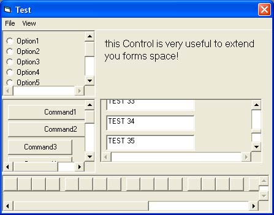



## IsPanel With Mouse Wheel Support

### Description

Did a complete rewrite of the core functionality in order to make the control a self contained container, with no need to code anything in the user form.

Latest version can be found here.

http://www.planetsourcecode.com/vb/scripts/ShowCode.asp?txtCodeId=59922&lngWId=1

A control that allows programmers to extend the aviable space in their forms, adding the posibility of show scrollbars

Credit to Fred.cpp for the Original Code submitted found here.

http://www.planetsourcecode.com/vb/scripts/ShowCode.asp?txtCodeId=45171&lngWId=1

I have added support for the Mouse Wheel,

and when a control that has focus is out of viewing range it will now place it in viewing range.
 
### More Info
 

             |
---                |---
**Submitted On**   |2005-04-07 20:27:38
**By**             |[DavidJ](https://github.com/Planet-Source-Code/PSCIndex/blob/master/ByAuthor/davidj.md)
**Level**          |Intermediate
**User Rating**    |4.3 (13 globes from 3 users)
**Compatibility**  |VB 5\.0, VB 6\.0
**Category**       |[VB function enhancement](https://github.com/Planet-Source-Code/PSCIndex/blob/master/ByCategory/vb-function-enhancement__1-25.md)
**World**          |[Visual Basic](https://github.com/Planet-Source-Code/PSCIndex/blob/master/ByWorld/visual-basic.md)
**Archive File**   |[IsPanel\_Wi187391482005\.zip](https://github.com/Planet-Source-Code/davidj-ispanel-with-mouse-wheel-support__1-59863/archive/master.zip)

